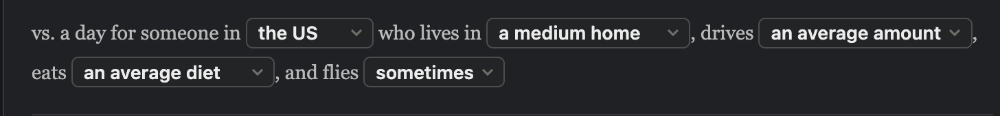
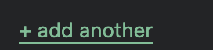
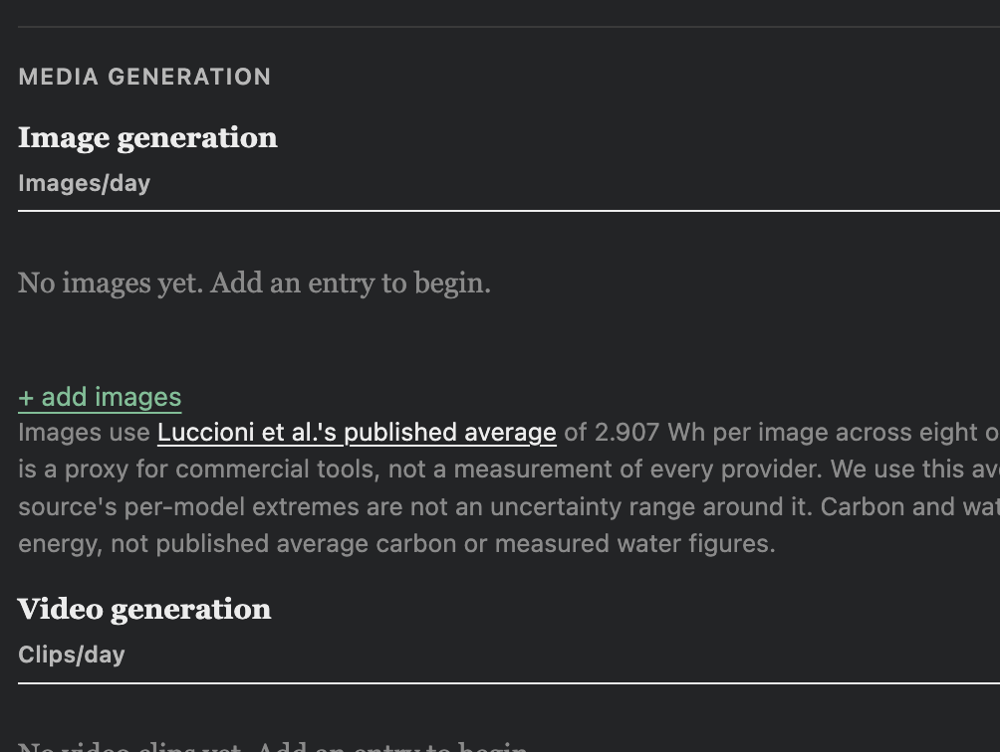
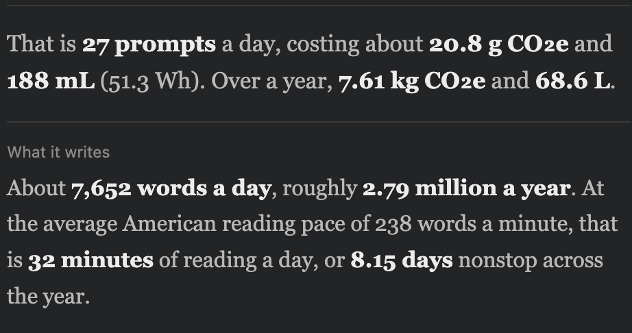
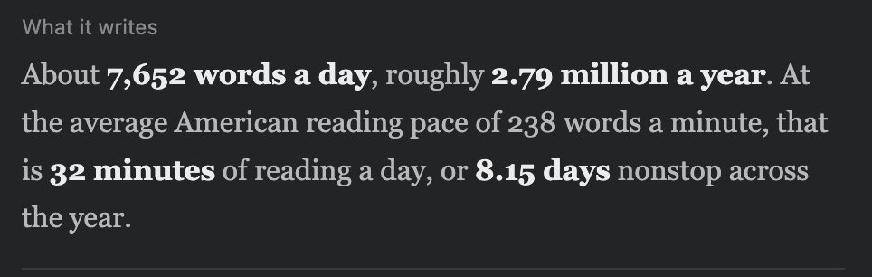

# Implementation conversation transcript

Full user and assistant messages from this session, exported in chronological order from the session record. Includes IDE context, interim updates, approval questions/replies, and attached screenshots. Internal reasoning, system/developer instructions, and tool diagnostics are not part of this conversation transcript.

---

## User — 2026-09-24T18:38:18.849Z

# Context from my IDE setup:

## Open tabs:
- sprightly-foraging-salamander.md: /Users/ellagault/.claude/plans/sprightly-foraging-salamander.md
- AGENTS.md: Unit-1-Project_AI-Explorations/AGENTS.md
- CLAUDE.md: Unit-1-Project_AI-Explorations/CLAUDE.md
- plan.md: Unit-1-Project_AI-Explorations/project-2-files/plan.md
- deploy.yml: Unit-1-Project_AI-Explorations/.github/workflows/deploy.yml

## My request:
review files and suggest where to pick up implementation 

---

## Agent — 2026-09-24T18:38:21.506Z

I’ll review the project guidance, plans, and current implementation to find the best place to pick up work.

---

## Agent — 2026-09-24T18:38:49.509Z

The code and latest transcript point to image/video generation as the next checkpoint. That implementation plan was drafted but left unapproved. Text retries and the coding-project builder are present; I also found stale checklist wording about coding retries that should be reconciled when work resumes.

---

## Agent — 2026-09-24T18:39:27.042Z

**Pick up with image and video generation**, using the [draft implementation plan](/Users/ellagault/.claude/plans/sprightly-foraging-salamander.md). The latest transcript confirms this is where work stopped: the feature specification is approved, but that implementation draft was left unapproved.

The current code has text retries and the coding-project builder. Image/video, digital-life activities, and router inputs remain placeholders. `npm run build` passes; I haven’t verified browser interactions in this review.

Before implementing the draft, I recommend three adjustments:

- **Fix numeric validation first.** [`clampInt`](/Users/ellagault/Downloads/AI_Explorations_Projects/Unit-1-Project_AI-Explorations/project_1_executables/src/pages/index.astro:720) strips non-digits: I confirmed `-5 → 5`, `1.5 → 15`, and `1e3 → 13`. Reusing it for media inputs would silently change entered values.
- **Include the media-only empty-state fix.** `renderRunning()` currently checks text prompts only. The draft correctly identifies this: image/video-only usage must display its footprint.
- **Make the export gap explicit.** The report independently calculates totals from text rows; adding media to the shared calculation helpers will not update it. Deferring report/share support leaves those outputs incomplete until the later checkpoint.

Also reconcile [plan.md](/Users/ellagault/Downloads/AI_Explorations_Projects/Unit-1-Project_AI-Explorations/project-2-files/plan.md): foundation work exists despite unchecked boxes, and several coding checklist items still describe retries that were subsequently removed.

Suggested sequence:

1. Correct validation and reconcile the checklist.
2. Implement image/video controls, calculations, limitations, and combined totals.
3. Verify image-only, video-only, mixed usage, retries, duration doubling, and reset.
4. Continue with digital-life activities and router, then complete reports, sharing, and comparison graphs.

No source files were changed. The only untracked file is the latest saved build transcript.

---

## User — 2026-09-24T18:41:10.716Z

# Context from my IDE setup:

## Active file: Unit-1-Project_AI-Explorations/project-2-files/plan.md

## Open tabs:
- plan.md: Unit-1-Project_AI-Explorations/project-2-files/plan.md
- sprightly-foraging-salamander.md: /Users/ellagault/.claude/plans/sprightly-foraging-salamander.md
- AGENTS.md: Unit-1-Project_AI-Explorations/AGENTS.md
- CLAUDE.md: Unit-1-Project_AI-Explorations/CLAUDE.md
- deploy.yml: Unit-1-Project_AI-Explorations/.github/workflows/deploy.yml

## My request:
how would you fix the numeric validation

---

## Agent — 2026-09-24T18:41:19.129Z

I’d replace “strip everything except digits” with **validate the whole input, then apply the allowed bounds**.

For whole-number fields—counts, retries, and coding lines:

- Accept digits only, allowing surrounding spaces.
- Reject negatives, decimals, scientific notation, and mixed text.
- Require a finite, safe integer.
- Apply the field’s limits: counts can be 0; retries must be at least 1.

For decimal fields—activity hours and router wattage—use a separate parser that accepts ordinary decimals such as `1.5`, while rejecting negative or malformed values.

I’d also separate validation from editing behavior: let users temporarily clear a field while typing, then validate on blur or Enter. Invalid input would show a short message and leave the last valid value in the calculation, rather than silently turning `-5` into `5` or `1.5` into `15`.

Finally, apply the same rules to shared-link values so URL input cannot bypass validation. Verify valid values, zero, blank input, negatives, decimals, malformed text, and upper limits.

---

## User — 2026-09-24T18:41:43.118Z

# Context from my IDE setup:

## Active file: Unit-1-Project_AI-Explorations/project-2-files/plan.md

## Open tabs:
- plan.md: Unit-1-Project_AI-Explorations/project-2-files/plan.md
- sprightly-foraging-salamander.md: /Users/ellagault/.claude/plans/sprightly-foraging-salamander.md
- AGENTS.md: Unit-1-Project_AI-Explorations/AGENTS.md
- CLAUDE.md: Unit-1-Project_AI-Explorations/CLAUDE.md
- deploy.yml: Unit-1-Project_AI-Explorations/.github/workflows/deploy.yml

## My request:
okay go ahead and do that

---

## Agent — 2026-09-24T18:41:46.788Z

I’ll update numeric parsing, field feedback, and shared-link validation, then check the edge cases and build the app.

---

## Agent — 2026-09-24T18:42:58.375Z

The fields now commit on blur or Enter. Invalid edits keep the last valid calculation and show an inline message; valid values are normalized to the field’s limits. I also applied this to employee count, which previously rounded decimals, and tightened shared-link parsing while preserving older links without a retry value.

---

## Agent — 2026-09-24T18:44:08.801Z

Implemented numeric validation in [index.astro](/Users/ellagault/Downloads/AI_Explorations_Projects/Unit-1-Project_AI-Explorations/project_1_executables/src/pages/index.astro).

- Invalid inputs preserve the last valid calculation and show inline feedback.
- Fields commit on blur or Enter.
- Valid numbers are constrained to each field’s limits.
- Shared links reject malformed numeric values; older links remain supported.

Three regression tests passed, along with the production build and whitespace checks. Browser layout and interactions still need a manual check. Changes are uncommitted.

Say `save transcript` to preserve this implementation session.

---

## User — 2026-09-24T18:44:53.860Z

# Context from my IDE setup:

## Active file: /Users/ellagault/.claude/plans/sprightly-foraging-salamander.md

## Open tabs:
- sprightly-foraging-salamander.md: /Users/ellagault/.claude/plans/sprightly-foraging-salamander.md
- plan.md: Unit-1-Project_AI-Explorations/project-2-files/plan.md
- AGENTS.md: Unit-1-Project_AI-Explorations/AGENTS.md
- CLAUDE.md: Unit-1-Project_AI-Explorations/CLAUDE.md
- deploy.yml: Unit-1-Project_AI-Explorations/.github/workflows/deploy.yml

## My request:
now that's fixed, implement the image/video generation

---

## Agent — 2026-09-24T18:45:04.183Z

I’ll implement the image/video plan, including media-only totals, reset behavior, source notes, and calculation checks. I’ll keep report and share-link support deferred as the draft specifies.

---

## Agent — 2026-09-24T18:47:43.177Z

The media controls and calculations are in place, and the build passes. Each media row shows energy, derived carbon, and derived water; video energy/carbon retain their range. I also updated the headline so image-only totals don’t show a redundant range. Next I’ll check the formulas and interactions.

---

## Agent — 2026-09-24T18:50:02.009Z

Browser checks passed for adding, editing, and removing media, retries, invalid-input feedback, reset, and keeping coding sessions outside daily totals. The 8-second video shows 21.6–47.3 Wh; doubling it to 16 seconds shows 43.2–94.6 Wh. The 375px layout also has no horizontal overflow. I’m adding retained calculation tests and recording the results in the project files.

---

## Agent — 2026-09-24T18:51:43.653Z

Implemented image/video generation. [Open the local calculator](http://127.0.0.1:4321/Unit-1-Project_AI-Explorations/).

- Add, edit, and remove media entries with retries and video duration.
- Media contributes to daily/yearly totals; coding stays separate.
- Added source notes, derived-water labels, ranges, and reset support.

Six automated tests, browser interaction checks, mobile layout checks, and the production build passed.

Report/share-link inclusion remains deferred and is disclosed onscreen. Changes are uncommitted.

Say `save transcript` to save this implementation session.

---

## User — 2026-09-24T18:52:55.108Z

# Context from my IDE setup:

## Open tabs:
- index.astro: Unit-1-Project_AI-Explorations/project_1_executables/src/pages/index.astro
- tsconfig.json: Unit-1-Project_AI-Explorations/project_1_executables/tsconfig.json
- numeric-validation.test.mjs: Unit-1-Project_AI-Explorations/project_1_executables/tests/numeric-validation.test.mjs
- plan.md: Unit-1-Project_AI-Explorations/project-2-files/plan.md
- sprightly-foraging-salamander.md: /Users/ellagault/.claude/plans/sprightly-foraging-salamander.md

## My request:
lets implement the next feature

---

## Agent — 2026-09-24T18:53:02.132Z

The next planned feature is digital-life comparisons: daily hours for streaming, video calls, gaming, and social media, with separate totals and source notes. I’ll implement that checkpoint, keeping it separate from AI-use totals and leaving the router baseline for the following feature.

---

## Agent — 2026-09-24T18:53:50.183Z

The calculation plan is clear: streaming keeps its published carbon figure, while the other activities use the selected grid factor. Gaming will remain a low–high range, including in the combined total. I’m checking the missing social-media source link before adding its citation.

---

## Agent — 2026-09-24T18:54:04.043Z

I found a unit error in the approved social-media formula: [Greenspector’s table](https://blog.greenspector.com/reseaux-sociaux-2021/) reports 15.81 mAh **per minute**, while the project documents say per hour. Correcting it makes the estimate 60 times larger: 3.50982 Wh per hour at the assumed 3.7 V. I’ll continue the other controls and calculations while getting your decision on that correction.

---

## Agent — 2026-09-24T18:54:06.932Z

May I correct social media to 15.81 mAh per minute (3.50982 Wh per hour at 3.7 V) and update research.md, spec.md, plan.md, and fixtures? The source explicitly uses minutes; I’m asking because spec.md requires user approval for changes to its approved calculation basis.
- Correct the units and continue (Recommended)
- Leave social media pending for review

---

## Agent — 2026-09-24T18:56:30.627Z

Streaming, video calls, and gaming are implemented, with independent decimal-hour inputs, daily/yearly results, and comparison bars. The build and existing tests pass. Social media remains pending your decision on the source-unit correction; I haven’t put the incorrect hourly figure into the app.

---

## User — 2026-09-24T18:57:14.319Z

<send_user_message_question_reply>
[{"questionItemId":"[\"request_user_input_async\",\"call_68x17cCNQ9WKtEanqIFN9s8e\",0]","question":"May I correct social media to 15.81 mAh per minute (3.50982 Wh per hour at 3.7 V) and update research.md, spec.md, plan.md, and fixtures? The source explicitly uses minutes; I’m asking because spec.md requires user approval for changes to its approved calculation basis.","answer":"Correct the units and continue (Recommended)"}]
</send_user_message_question_reply>

---

## Agent — 2026-09-24T18:57:24.210Z

I’ll apply the approved correction to the social-media calculation and project documents. It will remain a clearly labeled phone-battery proxy based on one app and device, rather than an estimate of the full social-media footprint.

---

## Agent — 2026-09-24T18:59:33.205Z

All four activities passed browser checks, including fractional hours, location changes, reset, and mobile layout. For one hour per day on the US grid, social media now shows 3.51 Wh and 1.33 g CO₂e; gaming shows 160–305 Wh and 60.8–116 g CO₂e. Activity edits leave AI totals unchanged.

---

## Agent — 2026-09-24T19:00:33.895Z

Implemented **digital-life comparisons**: streaming, video calls, gaming, and social media now have independent daily-hour inputs, daily/yearly results, and comparison bars. AI totals remain separate.

Applied your approved [social-media unit correction](https://blog.greenspector.com/reseaux-sociaux-2021/) and updated the project documents.

All 12 automated tests, browser/mobile checks, and the production build passed. Changes are uncommitted; report/share support remains deferred.

[Review locally](http://127.0.0.1:4321/Unit-1-Project_AI-Explorations/). The router baseline is next.

Say `save transcript` to preserve this session.

---

## User — 2026-09-24T19:00:49.646Z

# Context from my IDE setup:

## Open tabs:
- index.astro: Unit-1-Project_AI-Explorations/project_1_executables/src/pages/index.astro
- tsconfig.json: Unit-1-Project_AI-Explorations/project_1_executables/tsconfig.json
- numeric-validation.test.mjs: Unit-1-Project_AI-Explorations/project_1_executables/tests/numeric-validation.test.mjs
- plan.md: Unit-1-Project_AI-Explorations/project-2-files/plan.md
- sprightly-foraging-salamander.md: /Users/ellagault/.claude/plans/sprightly-foraging-salamander.md

## My request:
I think we should replace this section with the digital life section. any lines of hte bar graph referring to values derived from this section may be removed

---

## Agent — 2026-09-24T19:00:54.444Z

I’ll replace the lifestyle-profile section with the digital-life inputs and update the comparisons that depend on it. I’ll retain location as a separate electricity-grid setting, since the AI and digital-life carbon calculations still use it.

---

## Agent — 2026-09-24T19:02:29.568Z

The digital-life controls now occupy that section. I also removed the personal-footprint percentage display and report breakdown, since their inputs are gone. The remaining everyday comparison bars use fixed reference values, so they don’t depend on the removed profile. I’m checking the layout, report generation, and older share links.

---

## Agent — 2026-09-24T19:04:24.246Z

Replaced the lifestyle-profile section with **Your digital life**. Removed its footprint percentages and report breakdown, while retaining location for electricity calculations.

Fixed-reference comparison bars remain because they don’t depend on those inputs.

All 13 tests, desktop/mobile browser checks, and the build passed. Changes are uncommitted.

[Review locally](http://127.0.0.1:4321/Unit-1-Project_AI-Explorations/).

---

## User — 2026-09-24T19:07:01.850Z

# Context from my IDE setup:

## Open tabs:
- index.astro: Unit-1-Project_AI-Explorations/project_1_executables/src/pages/index.astro
- tsconfig.json: Unit-1-Project_AI-Explorations/project_1_executables/tsconfig.json
- numeric-validation.test.mjs: Unit-1-Project_AI-Explorations/project_1_executables/tests/numeric-validation.test.mjs
- plan.md: Unit-1-Project_AI-Explorations/project-2-files/plan.md
- sprightly-foraging-salamander.md: /Users/ellagault/.claude/plans/sprightly-foraging-salamander.md

## My request:
it looks great! What should we implement next?

---

## Agent — 2026-09-24T19:07:07.825Z

Next is the **home Wi-Fi/router baseline**, the last core feature.

- Adjustable wattage, defaulting to **6.5 W**, running 24 hours/day.
- Daily/yearly energy, carbon, and derived-water estimates.
- A separate comparison that stays outside AI and digital-activity totals.
- Source notes explaining the default and its limitations.

After that, finish report exports and share links for all new inputs, complete the project-total comparisons, and verify the full calculator. The optional pie chart comes last.

---

## User — 2026-09-24T19:07:29.878Z

# Context from my IDE setup:

## Open tabs:
- index.astro: Unit-1-Project_AI-Explorations/project_1_executables/src/pages/index.astro
- tsconfig.json: Unit-1-Project_AI-Explorations/project_1_executables/tsconfig.json
- numeric-validation.test.mjs: Unit-1-Project_AI-Explorations/project_1_executables/tests/numeric-validation.test.mjs
- plan.md: Unit-1-Project_AI-Explorations/project-2-files/plan.md
- sprightly-foraging-salamander.md: /Users/ellagault/.claude/plans/sprightly-foraging-salamander.md

## My request:
sounds good, go ahead and implement the wifi router baseline

---

## Agent — 2026-09-24T19:07:33.975Z

I’ll add the adjustable router baseline with a 6.5 W default, daily/yearly estimates, and its own comparison bars. I’ll keep it separate from AI-use and digital-activity totals.

---

## Agent — 2026-09-24T19:08:46.460Z

The router control and separate daily/yearly bars are in place, and the build passes. I’m checking that wattage changes affect only the router estimate, activity hours leave it unchanged, and Reset restores 6.5 W.

---

## Agent — 2026-09-24T19:11:03.129Z

Implemented the **Wi-Fi/router baseline** with adjustable wattage, a 6.5 W default, daily/yearly estimates, source notes, and separate comparison bars. Reset restores the default; AI and digital-activity totals remain separate.

All 15 tests, browser/mobile checks, and the build passed. Changes are uncommitted; report/share support remains deferred.

[Review locally](http://127.0.0.1:4321/Unit-1-Project_AI-Explorations/).

Say `save transcript` to preserve this session.

---

## User — 2026-09-24T19:14:28.570Z

# Context from my IDE setup:

## Open tabs:
- index.astro: Unit-1-Project_AI-Explorations/project_1_executables/src/pages/index.astro
- tsconfig.json: Unit-1-Project_AI-Explorations/project_1_executables/tsconfig.json
- numeric-validation.test.mjs: Unit-1-Project_AI-Explorations/project_1_executables/tests/numeric-validation.test.mjs
- plan.md: Unit-1-Project_AI-Explorations/project-2-files/plan.md
- sprightly-foraging-salamander.md: /Users/ellagault/.claude/plans/sprightly-foraging-salamander.md

## My request:
this is great. I want to clean the site up a bit before we continue. I want all "add another" to be buttons. I'm not a fan of the visual hierarchy. The category of AU shoudl be easier to see. You can adjust the font size and color, just make sure that you also adjust the "Your AI USe" accordingly as well

---

## Agent — 2026-09-24T19:14:32.433Z

I’ll give all add-entry controls a clear button style and strengthen the heading hierarchy: “Your AI use” first, then the AI categories, then image/video subheadings. I’ll check both light and dark themes.

---

## User — 2026-09-25T18:34:20.693Z

# Context from my IDE setup:

## Open tabs:
- index.astro: Unit-1-Project_AI-Explorations/project_1_executables/src/pages/index.astro
- tsconfig.json: Unit-1-Project_AI-Explorations/project_1_executables/tsconfig.json
- numeric-validation.test.mjs: Unit-1-Project_AI-Explorations/project_1_executables/tests/numeric-validation.test.mjs
- plan.md: Unit-1-Project_AI-Explorations/project-2-files/plan.md
- sprightly-foraging-salamander.md: /Users/ellagault/.claude/plans/sprightly-foraging-salamander.md

## My request:
finish implementing the above prompt

---

## Agent — 2026-09-25T18:34:28.056Z

I’ll finish the button styling and heading hierarchy, then check the result in light and dark themes at desktop and mobile widths.

---

## Agent — 2026-09-25T18:35:57.862Z

All four add-entry controls now have tinted backgrounds, borders, and keyboard-focus outlines. “Your AI use” is the largest heading, the categories use larger accent-colored text, and image/video headings sit one level below them. The build passes; I’m finishing the visual checks.

---

## Agent — 2026-09-25T18:36:27.345Z

The live development server is serving the new markup with the old CSS: the browser still reports the previous heading sizes. The visual check caught this twice. I’ll check the production build in a fresh preview server so I can verify the actual changes.

---

## Agent — 2026-09-25T18:37:10.789Z

Done—all four add controls now look like buttons, with clear hover and keyboard-focus states.

“Your AI use” is the strongest heading, followed by larger accent-colored category headings and smaller image/video subheadings.

Build and light/dark desktop/mobile checks passed. [Review the updated preview](http://127.0.0.1:4323/Unit-1-Project_AI-Explorations/). Changes are uncommitted.

---

## User — 2026-09-25T18:38:23.180Z

# Context from my IDE setup:

## Open tabs:
- index.astro: Unit-1-Project_AI-Explorations/project_1_executables/src/pages/index.astro
- tsconfig.json: Unit-1-Project_AI-Explorations/project_1_executables/tsconfig.json
- numeric-validation.test.mjs: Unit-1-Project_AI-Explorations/project_1_executables/tests/numeric-validation.test.mjs
- plan.md: Unit-1-Project_AI-Explorations/project-2-files/plan.md
- sprightly-foraging-salamander.md: /Users/ellagault/.claude/plans/sprightly-foraging-salamander.md

## My request:
remove the iframe that embeds the water use around the world site

---

## Agent — 2026-09-25T18:38:26.778Z

I’ll remove the embedded water-use site and its tab, along with the code that loads it.

---

## Agent — 2026-09-25T18:38:57.239Z

Removed the water-use iframe, its tab, and the related loading code and styles. The calculator’s water metric remains available.

Build passed. [View the updated preview](http://127.0.0.1:4323/Unit-1-Project_AI-Explorations/).

---

## User — 2026-09-25T18:42:14.488Z

# Context from my IDE setup:

## Open tabs:
- index.astro: Unit-1-Project_AI-Explorations/project_1_executables/src/pages/index.astro
- tsconfig.json: Unit-1-Project_AI-Explorations/project_1_executables/tsconfig.json
- numeric-validation.test.mjs: Unit-1-Project_AI-Explorations/project_1_executables/tests/numeric-validation.test.mjs
- plan.md: Unit-1-Project_AI-Explorations/project-2-files/plan.md
- sprightly-foraging-salamander.md: /Users/ellagault/.claude/plans/sprightly-foraging-salamander.md

## My request:
this blurb has a measurement for something in mL but doesn't specify what it is, can we fix that?

---

## Agent — 2026-09-25T18:42:19.636Z

I’ll label both the daily and yearly amounts as water, and clarify that Wh refers to electricity.

---

## Agent — 2026-09-25T18:42:39.661Z

Fixed: the blurb now says **“188 mL of water”**, **“51.3 Wh of electricity”**, and **“68.6 L of water”** for the yearly figure.

Build passed.

---

## User — 2026-09-25T18:44:05.253Z

# Context from my IDE setup:

## Open tabs:
- index.astro: Unit-1-Project_AI-Explorations/project_1_executables/src/pages/index.astro
- tsconfig.json: Unit-1-Project_AI-Explorations/project_1_executables/tsconfig.json
- numeric-validation.test.mjs: Unit-1-Project_AI-Explorations/project_1_executables/tests/numeric-validation.test.mjs
- plan.md: Unit-1-Project_AI-Explorations/project-2-files/plan.md
- sprightly-foraging-salamander.md: /Users/ellagault/.claude/plans/sprightly-foraging-salamander.md

## My request:
you didn't fix what I asked. That is **27 prompts** a day, costing about **20.8 g CO₂e** and **188 mL** (51.3 Wh). Over a year, **7.61 kg CO₂e** and **68.6 L**. this blurb does not specify what the 188 mL is

---

## Agent — 2026-09-25T18:44:09.470Z

I’ll check why the page is still showing the old wording and make sure the visible blurb says “188 mL of water.”

---

## Agent — 2026-09-25T18:44:54.216Z

The **188 mL is water use**. I’ve now verified the rendered page says **“188 mL of water”** and **“68.6 L of water.”**

Your open tab may still show the previous version. Refresh it or [open the verified preview](http://127.0.0.1:4323/Unit-1-Project_AI-Explorations/).

---

## User — 2026-09-25T18:46:06.396Z

# Context from my IDE setup:

## Open tabs:
- index.astro: Unit-1-Project_AI-Explorations/project_1_executables/src/pages/index.astro
- tsconfig.json: Unit-1-Project_AI-Explorations/project_1_executables/tsconfig.json
- numeric-validation.test.mjs: Unit-1-Project_AI-Explorations/project_1_executables/tests/numeric-validation.test.mjs
- plan.md: Unit-1-Project_AI-Explorations/project-2-files/plan.md
- sprightly-foraging-salamander.md: /Users/ellagault/.claude/plans/sprightly-foraging-salamander.md

## My request:
that looks great. Since we're no longer focused on text generation alone, I think we should come up with a better example to replace this text with

---

## Agent — 2026-09-25T18:46:12.901Z

I’d replace **“What it writes”** with **“What makes up your AI footprint?”**

For example:

> **Video generation accounts for 65% of your estimated daily AI carbon**, followed by text at 25% and images at 10%.

Those percentages would come from the entered usage and switch between carbon and water with the selected metric. Coding sessions would stay separate because they represent a whole project.

This gives the section a useful purpose across all generation types and helps people see which activity contributes most. Would you like that breakdown, or would you prefer an everyday equivalent, such as electricity used by a familiar appliance?

---

## User — 2026-09-25T18:46:37.999Z

# Context from my IDE setup:

## Open tabs:
- index.astro: Unit-1-Project_AI-Explorations/project_1_executables/src/pages/index.astro
- tsconfig.json: Unit-1-Project_AI-Explorations/project_1_executables/tsconfig.json
- numeric-validation.test.mjs: Unit-1-Project_AI-Explorations/project_1_executables/tests/numeric-validation.test.mjs
- plan.md: Unit-1-Project_AI-Explorations/project-2-files/plan.md
- sprightly-foraging-salamander.md: /Users/ellagault/.claude/plans/sprightly-foraging-salamander.md

## My request:
I put having a pie chart in as a stretch goal, maybe we could implement that here

---

## Agent — 2026-09-25T18:46:44.406Z

I’ll replace “What it writes” with the planned pie chart. It will follow the carbon/water toggle and show daily AI use, digital activities, the router, and any coding sessions you explicitly select for that day. I’ll include a text breakdown and keep the coding-project total separate.

---

## Agent — 2026-09-25T18:47:13.847Z

Gaming has a range but no supported average, so the chart will offer lower- and upper-estimate views instead of inventing a midpoint. The text breakdown will show each value, its range where applicable, and its share of the selected total.

---

## Agent — 2026-09-25T18:49:32.702Z

The chart and text breakdown are in place, with a checkbox on each coding session to include it once. All 18 calculation and validation tests pass, including checks that chart selection leaves daily AI totals and the coding-project total unchanged. I’m checking the live controls, empty state, and mobile layout now.

---

## Agent — 2026-09-25T18:51:11.721Z

The browser checks passed: both metric controls stay synchronized, selected coding sessions update the chart without changing other totals, and zero usage shows an empty state. The chart also fits desktop and mobile layouts in both themes. I’m recording the completed stretch feature and its range-handling behavior in the plan.

---

## Agent — 2026-09-25T18:51:41.065Z

Implemented the pie chart in place of “What it writes.”

- Switches between carbon and water.
- Includes AI use, digital activities, router, and selected coding sessions.
- Provides lower/upper estimates and a text breakdown.
- Keeps coding-project totals unchanged.

All 18 tests, browser/mobile checks, and the build passed. Report/share support remains deferred; changes are uncommitted.

[View the updated preview](http://127.0.0.1:4323/Unit-1-Project_AI-Explorations/).

---

## User — 2026-09-25T18:54:12.202Z

# Context from my IDE setup:

## Open tabs:
- plan.md: Unit-1-Project_AI-Explorations/project-2-files/plan.md
- numeric-validation.test.mjs: Unit-1-Project_AI-Explorations/project_1_executables/tests/numeric-validation.test.mjs
- media-calculations.test.mjs: Unit-1-Project_AI-Explorations/project_1_executables/tests/media-calculations.test.mjs
- digital-life.test.mjs: Unit-1-Project_AI-Explorations/project_1_executables/tests/digital-life.test.mjs
- index.astro: Unit-1-Project_AI-Explorations/project_1_executables/src/pages/index.astro

## My request:
can you make the colors on the pie chart fit better with the colors already in use? use the green and blue that are already used on the sight and pick two other colors with similar saturations and brtighnesses

---

## Agent — 2026-09-25T18:54:18.398Z

I’ll use the site’s green and blue, plus a muted gold and purple with similar saturation and brightness. I’ll match the legend swatches to the slices and check both themes.

---

## Agent — 2026-09-25T18:55:25.134Z

Updated the pie chart to use the site’s **green and blue**, plus coordinated **muted gold and purple**. Legend swatches match, with theme-specific shades for light and dark mode.

Build and browser checks passed. [View the preview](http://127.0.0.1:4323/Unit-1-Project_AI-Explorations/).

---

## User — 2026-09-25T18:57:33.830Z

# Context from my IDE setup:

## Open tabs:
- plan.md: Unit-1-Project_AI-Explorations/project-2-files/plan.md
- numeric-validation.test.mjs: Unit-1-Project_AI-Explorations/project_1_executables/tests/numeric-validation.test.mjs
- media-calculations.test.mjs: Unit-1-Project_AI-Explorations/project_1_executables/tests/media-calculations.test.mjs
- digital-life.test.mjs: Unit-1-Project_AI-Explorations/project_1_executables/tests/digital-life.test.mjs
- index.astro: Unit-1-Project_AI-Explorations/project_1_executables/src/pages/index.astro

## My request:
can you remove the golf bars in the bar charts

---

## Agent — 2026-09-25T18:57:37.065Z

I’ll remove the golf entries from the bar charts and generated report.

---

## User — 2026-09-26T01:54:05.472Z

# Context from my IDE setup:

## Open tabs:
- plan.md: Unit-1-Project_AI-Explorations/project-2-files/plan.md
- numeric-validation.test.mjs: Unit-1-Project_AI-Explorations/project_1_executables/tests/numeric-validation.test.mjs
- media-calculations.test.mjs: Unit-1-Project_AI-Explorations/project_1_executables/tests/media-calculations.test.mjs
- digital-life.test.mjs: Unit-1-Project_AI-Explorations/project_1_executables/tests/digital-life.test.mjs
- index.astro: Unit-1-Project_AI-Explorations/project_1_executables/src/pages/index.astro

## My request:
remove the golf bars

---

## Agent — 2026-09-26T01:54:26.331Z

Removed all three golf bars from the carbon/water charts and generated report. Build passed.

---

## User — 2026-09-26T01:54:36.988Z

# Context from my IDE setup:

## Open tabs:
- plan.md: Unit-1-Project_AI-Explorations/project-2-files/plan.md
- numeric-validation.test.mjs: Unit-1-Project_AI-Explorations/project_1_executables/tests/numeric-validation.test.mjs
- media-calculations.test.mjs: Unit-1-Project_AI-Explorations/project_1_executables/tests/media-calculations.test.mjs
- digital-life.test.mjs: Unit-1-Project_AI-Explorations/project_1_executables/tests/digital-life.test.mjs
- index.astro: Unit-1-Project_AI-Explorations/project_1_executables/src/pages/index.astro

## My request:
save transcript

---

## Agent — 2026-09-26T01:54:48.142Z

I’ll save this conversation as a timestamped Markdown transcript in the project’s `transcripts` folder.

